# Architecture Diagrams

This document contains visual representations of the Data Streaming Pipeline architecture.

## System Overview

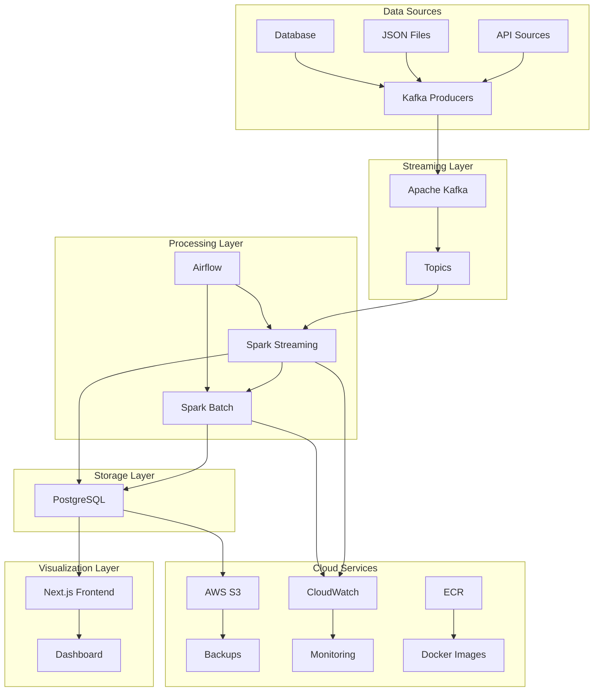

## Data Flow Diagram

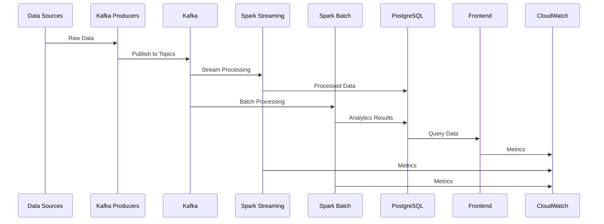

## Infrastructure Architecture

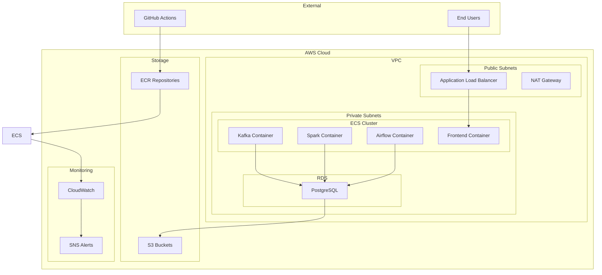

## Component Interaction Diagram

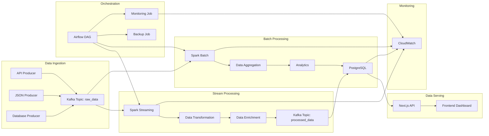

## Deployment Pipeline

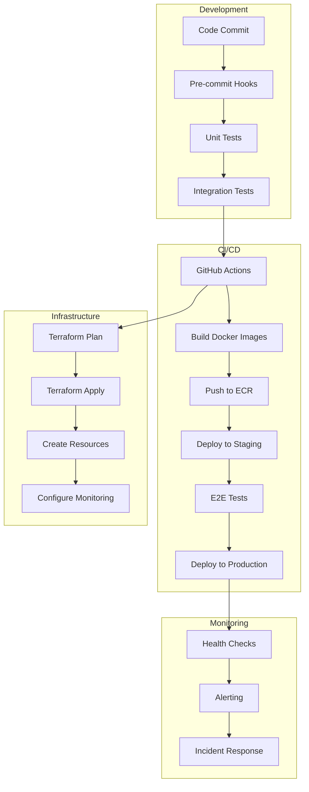

## Security Architecture

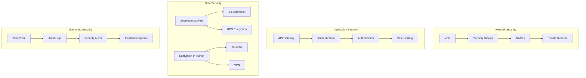

## Scalability Architecture

```mermaid
graph TB
    subgraph "Horizontal Scaling"
        A1[Load Balancer] --> A2[Multiple Instances]
        A2 --> A3[Auto Scaling Groups]
        A3 --> A4[Health Checks]
    end
    
    subgraph "Data Scaling"
        B1[Kafka Partitions] --> B2[Consumer Groups]
        B2 --> B3[Spark Workers]
        B3 --> B4[Database Sharding]
    end
    
    subgraph "Storage Scaling"
        C1[S3] --> C2[Lifecycle Policies]
        C2 --> C3[Data Archival]
        C3 --> C4[Cost Optimization]
    end
    
    subgraph "Monitoring Scaling"
        D1[CloudWatch] --> D2[Custom Metrics]
        D2 --> D3[Auto Scaling Triggers]
        D3 --> D4[Resource Optimization]
    end
```

## Error Handling Flow

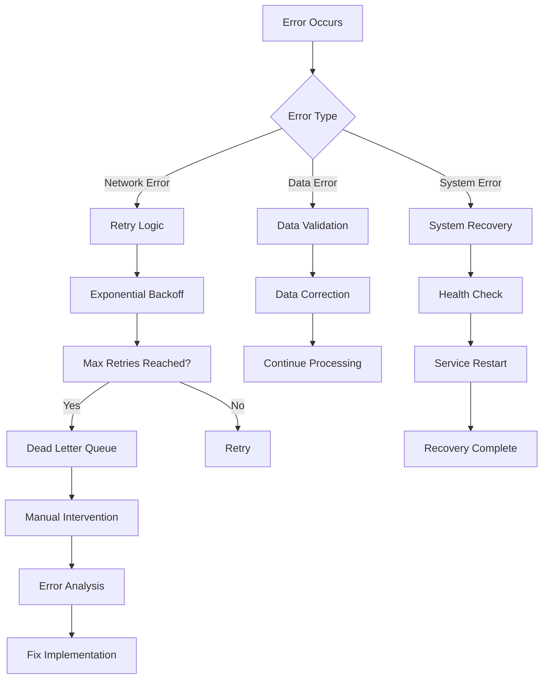

## Backup and Recovery Flow

```mermaid
graph TB
    subgraph "Backup Process"
        A1[Scheduled Backup] --> A2[Database Snapshot]
        A2 --> A3[Data Export]
        A3 --> A4[S3 Upload]
        A4 --> A5[Verification]
    end
    
    subgraph "Recovery Process"
        B1[Recovery Request] --> B2[Backup Selection]
        B2 --> B3[Data Download]
        B3 --> B4[Database Restore]
        B4 --> B5[Data Validation]
        B5 --> B6[Service Restart]
    end
    
    subgraph "Monitoring"
        C1[Backup Status] --> C2[Success/Failure Alerts]
        C2 --> C3[Recovery Testing]
        C3 --> C4[RTO/RPO Metrics]
    end
```

## Performance Optimization

```mermaid
graph TB
    subgraph "Data Optimization"
        A1[Data Partitioning] --> A2[Index Optimization]
        A2 --> A3[Query Optimization]
        A3 --> A4[Caching Strategy]
    end
    
    subgraph "Processing Optimization"
        B1[Spark Tuning] --> B2[Memory Management]
        B2 --> B3[Parallel Processing]
        B3 --> B4[Resource Allocation]
    end
    
    subgraph "Network Optimization"
        C1[Connection Pooling] --> C2[Compression]
        C2 --> C3[CDN Usage]
        C3 --> C4[Load Balancing]
    end
    
    subgraph "Monitoring Optimization"
        D1[Performance Metrics] --> D2[Bottleneck Analysis]
        D2 --> D3[Optimization Recommendations]
        D3 --> D4[Continuous Improvement]
    end
```

## Cost Optimization

```mermaid
graph TB
    subgraph "Resource Optimization"
        A1[Right Sizing] --> A2[Auto Scaling]
        A2 --> A3[Spot Instances]
        A3 --> A4[Reserved Instances]
    end
    
    subgraph "Storage Optimization"
        B1[Lifecycle Policies] --> B2[Data Archival]
        B2 --> B3[Compression]
        B3 --> B4[Cleanup Jobs]
    end
    
    subgraph "Monitoring Costs"
        C1[Cost Alerts] --> C2[Budget Tracking]
        C2 --> C3[Cost Analysis]
        C3 --> C4[Optimization Actions]
    end
    
    subgraph "Automation"
        D1[Cost Automation] --> D2[Scheduled Scaling]
        D2 --> D3[Resource Cleanup]
        D3 --> D4[Cost Reporting]
    end
```

These diagrams provide a comprehensive visual representation of the Data Streaming Pipeline architecture, covering system overview, data flow, infrastructure, security, scalability, and operational aspects.
